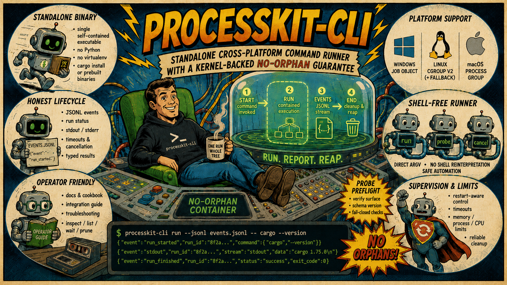

[](https://crates.io/crates/processkit-cli)
[](https://zelanton.github.io/ProcessKit-CLI/)
[](https://github.com/ZelAnton/ProcessKit-CLI/actions/workflows/ci.yml)
[](https://github.com/ZelAnton/ProcessKit-CLI/blob/main/LICENSE)

# processkit-cli

`processkit-cli` is the standalone command runner for ProcessKit. It executes
one shell-free command inside the public [`processkit`](https://crates.io/crates/processkit)
crate's containment boundary, preserves the child's exit code, and records a
versioned JSONL lifecycle stream without requiring a Rust or Python runtime at
the call site.

The runner owns the command-line and event contracts. ProcessKit-rs remains the
single source of truth for containment, teardown, PID-reuse discipline, and
platform lifecycle behavior. The cover above represents the wider ProcessKit
family; this CLI deliberately focuses on one contained run and its control
plane rather than exposing the core crate's pipelines, retries, or scheduling
APIs.

For an adoption-oriented comparison with `timeout`, process groups, systemd,
containers, Tini, and PowerShell, see [Why ProcessKit CLI?](why-processkit-cli.md).
The guide explicitly identifies the cases where a smaller or wider supervisor
is the better fit.

## Install

Download a platform archive from the
[latest GitHub release](https://github.com/ZelAnton/ProcessKit-CLI/releases/latest),
or build and install from crates.io:

```sh
cargo install processkit-cli
```

Release archives contain the binary, shell completions, man pages, the JSON
Schema, a SHA-256 checksum, and a signed build-provenance attestation.
See [Installation and distribution](installation.md) for target selection,
checksum/attestation verification, completions, man pages, and post-install
preflight.

## Quick start

Run a command directly, with no shell between the runner and the program:

```sh
processkit-cli run --jsonl events.jsonl -- cargo --version
```

Child stdout and stderr pass through unchanged. Lifecycle events go only to
`events.jsonl`, so an adapter can consume them without parsing or contaminating
the child's output.

Use a stable run id when another process needs to inspect or stop the live run:

```sh
processkit-cli run --run-id build-42 --jsonl events.jsonl -- cargo test
processkit-cli inspect --run-id build-42 --json
processkit-cli cancel --run-id build-42
```

The control commands address a per-user registry entry and a live local IPC
endpoint, never an operating-system PID. A reused PID therefore cannot retarget
an old command at an unrelated process.

## Choose a run shape

| You need | Use |
| --- | --- |
| A normal CI command with live output | Default `run`: closed stdin, pipe + echo stdout/stderr. |
| A real existing terminal | `--inherit-stdio` (no capture or idle timeout). |
| Finite input | `--stdin-file FILE`. |
| Durable bounded transcripts | `--capture-dir DIR`, optionally `--no-echo`. |
| A stuck-worker detector | `--idle-timeout DURATION`. |
| A recorded history of how the process tree evolved | `--snapshot-interval DURATION` (composes with every I/O mode and with `--detach`). |
| External tools launched by an automation agent | A foreground run with a unique id, finite deadlines, JSONL, and bounded capture. |
| Launch now, supervise from another process | `--detach` plus a durable JSONL path and run id. |
| Whole-tree resource caps | `--max-memory`, `--max-processes`, `--cpu-quota` where supported. |

The [Cookbook](cookbook.md) gives copyable complete invocations. The narrative
guides explain why combinations are accepted or rejected.

## Use from automation agents

An automation or coding agent can use this binary without a dedicated SDK. A
project instruction can simply require external tools to be launched through
`processkit-cli run` with a unique run id, finite deadlines, lifecycle JSONL,
and bounded capture. The agent then has explicit `inspect` / `cancel` / `wait` /
`kill` recovery operations instead of tracking a fragile PID or cleaning up by
process name.

This makes agent-driven builds, tests, compilers, and long-lived workers more
robust: descendant cleanup is scoped to the run, silent hangs can be bounded,
diagnostics survive an interrupted agent turn, and different workloads can use
different timeout, output, environment, and resource strategies. It does not
pretend that disappearance of an arbitrary agent process is itself a portable
cleanup signal; prefer foreground runs, terminate the runner during agent
teardown, and use finite deadlines. Detached work needs a separate supervisor.

See [Agent and automation workflows](agent-workflows.md) for a ready-to-paste
agent policy and complete foreground, recovery, and escalation examples.

## What the runner guarantees

- **One owned process tree.** Normal completion, timeout, cancellation, and
  runner errors tear down the current run's ProcessKit container. Cleanup never
  searches by executable name.
- **Exit-code fidelity.** A normal child exit is returned unchanged. Runner
  failures occupy the documented `100`-`119` band and also emit `runner_exit`,
  so a child code is never silently aliased.
- **Separated streams.** Child output stays on stdout/stderr; JSONL events stay
  in `--jsonl`; runner diagnostics never enter child stdout.
- **Redacted diagnostics.** Events contain a SHA-256 argv fingerprint and a
  classified worker hint by default. Raw arguments require `--argv-raw`.
- **Bounded capture.** `--capture-dir` tees stdout and stderr into separate,
  size-capped transcripts with byte counts, hashes, and truncation metadata.
- **Honest platform reporting.** `run_started` records the active containment
  mechanism and the real abrupt-runner-death cleanup guarantee rather than
  presenting every operating system as equivalent.

## Command surface

| Command | Purpose |
| --- | --- |
| `run` | Start one contained, shell-free command and write lifecycle JSONL. |
| `inspect` | Snapshot a live run and its current members. |
| `cancel` | Request soft stop, wait through the grace window, then hard-kill survivors. |
| `kill` | Hard-kill the run's whole container immediately. |
| `attest` | Ask a live run whether the calling process is inside its container — a kernel-checked containment fact. |
| `wait` | Wait for one run, or a snapshot of all live runs, to finish. |
| `events` | Read a run's JSONL lifecycle stream back: render, follow, pass through, or validate it. |
| `list` | Discover live, stale, and unprobed registry entries. |
| `prune` | Remove only entries confirmed stale. |
| `probe` | Verify the binary's versioned compatibility surface before launch. |

Run `processkit-cli <command> --help` for the complete flag set. The
[integration guide](integration.md) shows a fail-closed adapter workflow from
preflight through cleanup.

## Platform behavior

| Platform | Preferred mechanism | Abrupt runner death |
| --- | --- | --- |
| Windows | Job Object | Whole tree is reaped by kernel kill-on-close. |
| Linux | cgroup v2, with process-group fallback | Direct child only when parent-death signaling is available. |
| macOS / other Unix | POSIX process group | No automatic whole-tree guarantee after an uncatchable runner death. |

Every ordinary teardown still uses the active container on every supported
platform. The last column is intentionally narrower: it describes only a crash,
`SIGKILL`, or comparable event that prevents the runner from executing its own
cleanup path. See the [architecture](architecture.md) and
[troubleshooting guide](troubleshooting.md) for the exact caveats.

## Guides

| Guide | Covers |
| --- | --- |
| [Installation and distribution](installation.md) | Archives, package-manager manifests, target selection, checksums, attestations, Cargo, completions, man pages. |
| [Cookbook](cookbook.md) | Task → command recipes for common foreground, detached, capture, control, and container workflows. |
| [Agent and automation workflows](agent-workflows.md) | A drop-in agent instruction, bounded execution strategies, recovery, and honest agent-stop guarantees. |
| [Running commands](running-commands.md) | Shell-free argv, cwd, environment, run ids, foreground lifecycle, and flag interactions. |
| [Standard I/O and capture](io-and-capture.md) | Default pipes, inherited handles, stdin files, no-echo, bounded transcripts, TTY caveats. |
| [Detached runs](detached-runs.md) | Startup proof, changed launcher exit semantics, recovery, and out-of-band supervision. |
| [Timeouts and cancellation](timeouts-and-cancellation.md) | Overall/idle clocks, grace, signals, cancel vs kill, and platform soft-stop behavior. |
| [Resource limits](resource-limits.md) | Whole-tree memory/process/CPU caps and fail-closed enforcement. |
| [Platform support](platform-support.md) | Release targets, mechanisms, abrupt cleanup, capability and CI matrices. |
| [Running in containers](containers.md) | musl/glibc images, PID 1, signals, writable paths, cgroup delegation, outer limits. |
| [Integration guide](integration.md) | Probe, launch, event consumption, supervision, and housekeeping for adapters. |
| [Compatibility and upgrades](compatibility.md) | Surface tokens, schema/exit-band pinning, rolling upgrades, and acceptance policy. |
| [Live-run control plane](control-plane.md) | IPC transport, inspect/cancel/kill/attest semantics, and safe targeting. |
| [Run registry](registry.md) | Per-user records, liveness probing, ambiguity, waiting, and pruning. |
| [JSONL event schema](schema.md) | The normative `schema_version = 1` contract and golden fixtures. |
| [Exit-code contract](exit-codes.md) | Child-code fidelity, the reserved runner failure band, and the `--error-format json` machine-error envelope built over it. |
| [Troubleshooting](troubleshooting.md) | Symptom-to-cause diagnosis for operators and CI. |
| [Threat model](threat-model.md) | Trusted boundaries, hostile inputs, local IPC, and supply chain. |
| [Architecture](architecture.md) | Module map and the data flow of one run. |

## The 60-second tour

```sh
# 1. Prove the installed runner supports the contract your caller needs.
processkit-cli probe --json \
  --require-schema-version 1 \
  --require-exit-code-band 100-119 \
  --require-surface run:--capture-dir

# 1b. Once per host: prove this machine can actually contain and control a process.
processkit-cli doctor --json

# 2. Start one shell-free command with a stable id and bounded transcripts.
processkit-cli run --run-id demo --capture-dir ./demo-output \
  --jsonl demo.jsonl -- cargo test

# 3. While it is live, inspect or cancel it from another process.
processkit-cli inspect --run-id demo --json
processkit-cli cancel --run-id demo

# 4. Read its lifecycle story back — live, or long after it finished.
processkit-cli events --run-id demo --follow
processkit-cli events --file demo.jsonl

# 5. Discover or clean up registry state after an orchestrator restart.
processkit-cli list --json
processkit-cli prune --dry-run --json
```

The JSONL file is the durable lifecycle record. The registry and control
endpoint exist only while a run is live (or as detectable stale leftovers after
an abrupt runner death).

Source, release history, and contribution guidance live in the
[GitHub repository](https://github.com/ZelAnton/ProcessKit-CLI).
